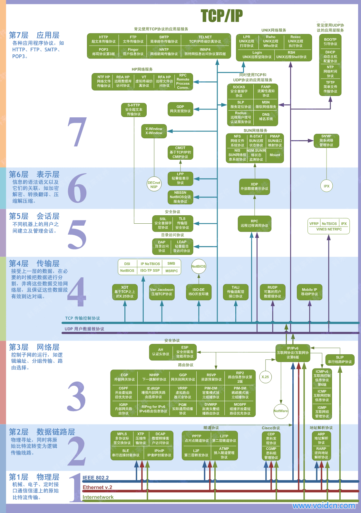
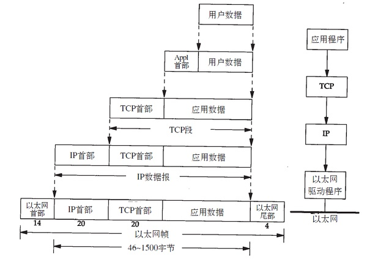
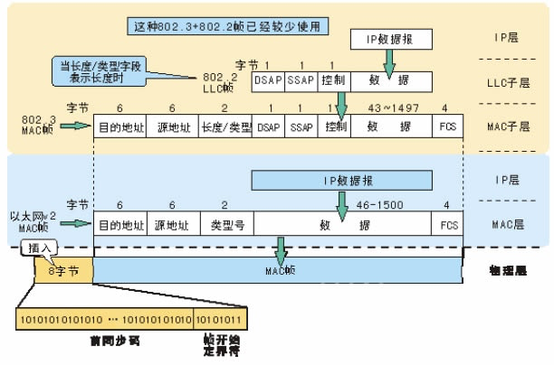
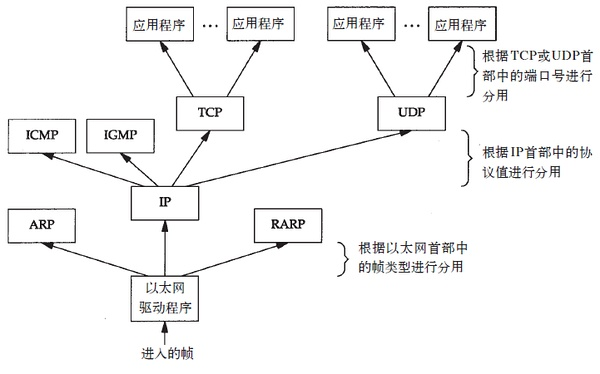
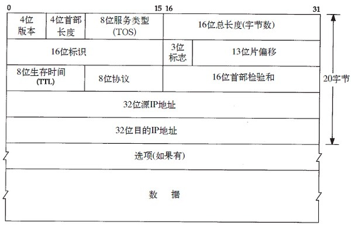

# 网络基础：TCP/IP 模型速览（学习笔记版）

## 1. TCP/IP 四层与 OSI 七层：怎么对应

TCP/IP 常用四层（从下到上）：
- 链路层（Link）：以太网帧、ARP 等，负责在“同一链路/同一二层网络”里把数据送到下一跳
- 网络层（Internet）：IP，负责跨网络寻址与转发（逐跳）
- 传输层（Transport）：TCP/UDP，负责端到端的传输语义（可靠性/复用/拥塞控制等）
- 应用层（Application）：HTTP/DNS/SMTP/SSH… 面向应用协议

OSI 七层（理论模型）



## 2. 封装与分用：数据是怎么“套娃”的

发送端：每下沉一层就加一层头（链路层通常还会有尾部/FCS），接收端反向剥离：

```
应用数据
  ↓ + TCP/UDP Header
TCP/UDP Segment
  ↓ + IP Header
IP Packet (Datagram)
  ↓ + Ethernet Header + (FCS)
Ethernet Frame
```

接收端的“分用”（Demux）：每一层根据头部里的类型字段，把载荷交给正确的上层协议处理。

## 3. 链路层要点：以太网、PPP、环回与 MTU





### 3.1 以太网帧里最关键的字段
- 目的 MAC / 源 MAC：二层寻址
- EtherType（或 802.3 + LLC/SNAP）：指明上层是 IPv4/IPv6/ARP…
- Payload：承载 IP 包等
- FCS：链路层校验（由网卡/驱动处理，应用一般感知不到）

### 3.2 PPP / SLIP（历史与场景）
- SLIP：早期串口链路封装思路简单，但能力弱（类型标识、协商、校验等不足）
- PPP：在点到点链路上更通用，支持协议类型、链路控制、校验、协商（包含地址协商等机制）

### 3.3 环回接口（Loopback）
- 典型用途：同一台机器上的进程通过 TCP/IP 通信（例如访问 127.0.0.1/::1）
- 很多本机发往“本机 IP”的流量也会走环回路径，便于统一处理

### 3.4 MTU（Maximum Transmission Unit）
- MTU：接口一次能承载的“网络层负载”上限（常见以太网为 1500）
- Jumbo Frame：更大的 MTU（如 9000）常用于局域网/数据中心以提升效率，但需要链路全路径支持并正确配置

## 4. IP（网络层）：尽力而为、无连接、逐跳转发





IP 的核心定位：
- 尽力而为：不承诺必达，不承诺顺序，不承诺不重复
- 无连接：不建立“会话”，每个包独立转发
- 跨网转发：依赖路由表选择下一跳

### 4.1 路由的直觉（逐跳）
- 发送端只关心“下一跳是谁”（next hop），不需要知道完整路径
- 每一跳会改变链路层头（MAC 会变），但 IP 头中的目的 IP 不变（直到到达目标）

### 4.2 路由表匹配的常见优先级（便于记忆）
- 更具体的匹配优先（主机路由/更长前缀）通常优先于更粗的网络路由
- 如果都匹配不上，则尝试默认路由（0.0.0.0/0 或 ::/0）
- 都没有就会失败（系统通常向上层返回“不可达”）

## 5. IPv4 地址与通信方式：单播/广播/多播

### 5.1 传统 A/B/C 类（偏历史概念）
- A/B/C 类划分是早期规划方式；现代网络主要使用 CIDR（无类域间路由，形如 /24、/16）
- 了解 A/B/C 的价值：帮助理解默认掩码与一些经典叙述

### 5.2 单播、广播、多播
- 单播（Unicast）：一对一
- 广播（Broadcast）：一对“一个二层广播域内的所有主机”（二层目的 MAC 通常为 FF:FF:FF:FF:FF:FF）
- 多播（Multicast）：一对多（加入某个多播组的一组主机）

多播与以太网 MAC 的常见映射直觉：
- IPv4 多播地址范围：224.0.0.0/4
- 以太网多播 MAC 前缀常见为 01:00:5e:xx:xx:xx（映射不是一一对应，可能出现“同 MAC 对应多个组”的过滤需求）

## 6. 子网掩码：判断“本地”还是“远端”

用子网掩码（或 CIDR 前缀）回答三个问题：
- 哪些 bit 是网络号、哪些是主机号
- 目的 IP 是否在同一网段（同网段通常直接二层可达，否则要走网关）
- 计算网络地址、广播地址（IPv4）

一个快速心智模型：
- `IP & Mask` 得到网络地址
- 若 `dstIP & Mask == localIP & Mask`，通常认为在同一子网（仍需考虑策略路由等特殊情况）

## 7. 分片、PMTU 与 MSS：大包怎么在路上活下来

### 7.1 IPv4 分片（Fragmentation）
- 当 IP 包大于某段链路 MTU，可能需要分片
- DF（Don’t Fragment）位控制是否允许分片
- 分片后用 MF（More Fragments）与 Fragment Offset 标识重组关系
- Offset 以 8 字节为单位（因此分片负载通常按 8 字节对齐，最后一个除外）

分片的典型代价（学习时重点记“为什么要避免”）：
- 发送端/接收端 CPU 与内存开销
- 任一分片丢失可能导致整包不可用（需要重传）
- 中间盒（防火墙/NAT 等）可能对乱序分片更敏感

### 7.2 PMTU（Path MTU Discovery）
- 目标：找到端到端路径上的最小 MTU，避免中途分片
- 做法：发送端设置 DF=1；若中途某跳放不下，路由器会用 ICMP 报错并携带可用 MTU 信息，发送端再缩小包尺寸重试

### 7.3 TCP 的 MSS（Maximum Segment Size）
- MSS 约束的是 TCP 载荷大小（segment payload）
- 常见以太网场景：`MSS ≈ MTU(1500) - IPv4(20) - TCP(20) = 1460`
- TCP 在握手阶段通过选项互相通告 MSS；再结合 PMTU/拥塞控制决定实际分段策略

## 8. 网卡与内核卸载：TSO/GSO/GRO 的直觉

现代系统常把“切片/聚合”的部分工作交给网卡或在内核做更高效的批处理：
- TSO/LSO：发送侧把大块数据交给 NIC/内核再切成合适大小
- GSO：更通用的发送侧分段框架（不局限 TCP）
- GRO/LRO：接收侧把多个小包合并后再上送协议栈（提升处理效率）

学习时只要抓住一条主线：
- 逻辑上仍然遵守 MTU/MSS/协议语义
- 只是“在哪里切/在哪里合”变了，以提升性能


